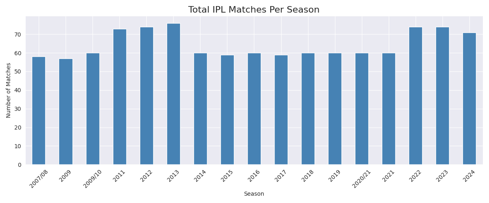
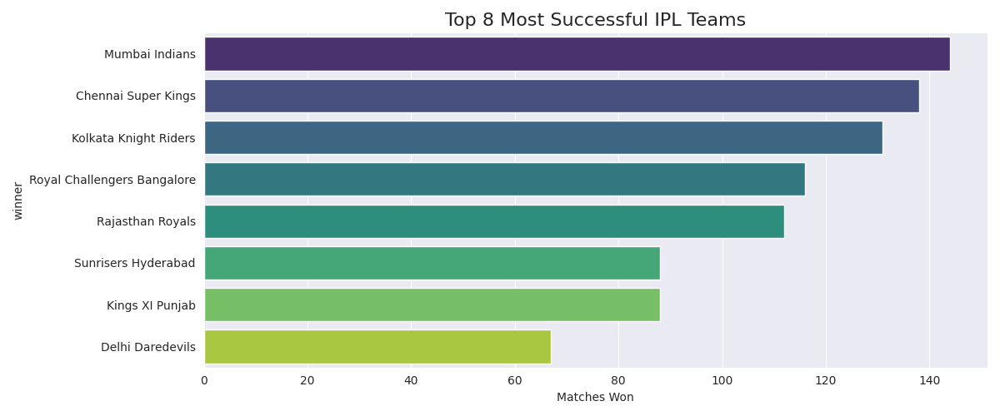
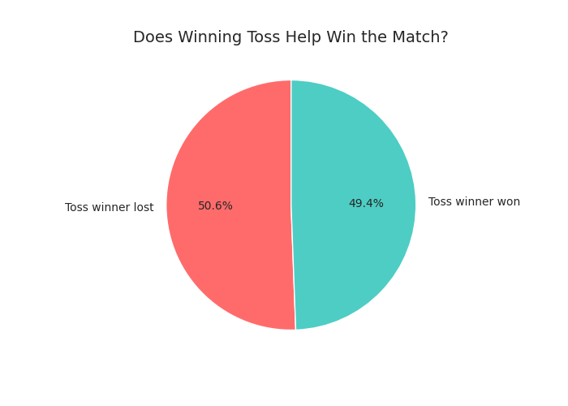
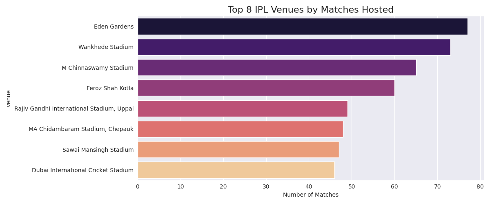

# IPL Match Analysis 🏏

## About
Analysis of IPL matches from 2008 to 2020 using Python.

## What I analysed
- Total matches per season
- Top 8 most successful teams
- Toss impact on match result
- Top venues by matches hosted

## Tools Used
- Python
- Pandas
- Matplotlib
- Seaborn

## Dataset
IPL Complete Dataset 2008-2020 from Kaggle

## Charts

